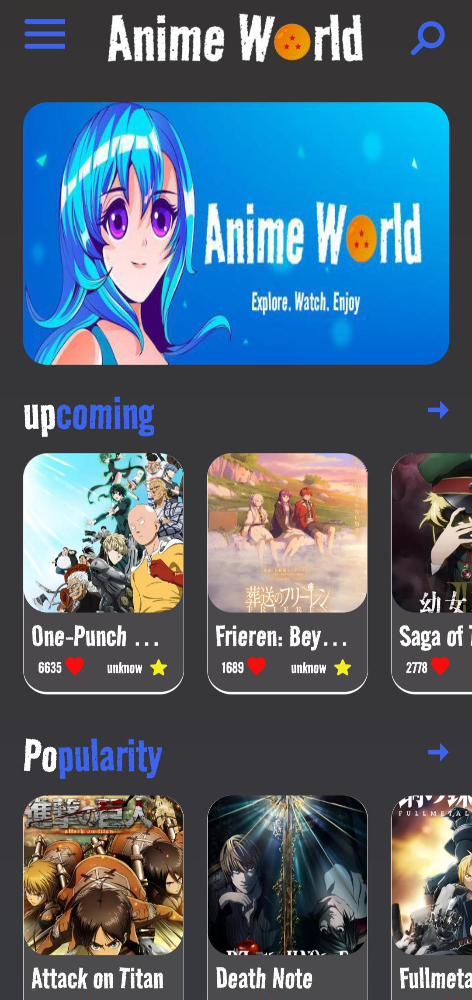
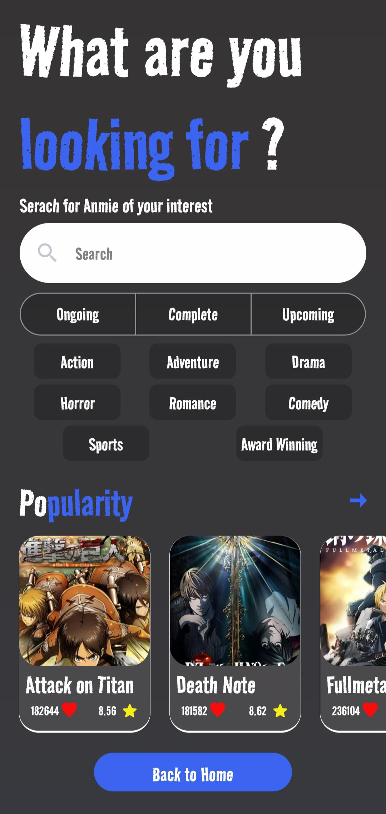
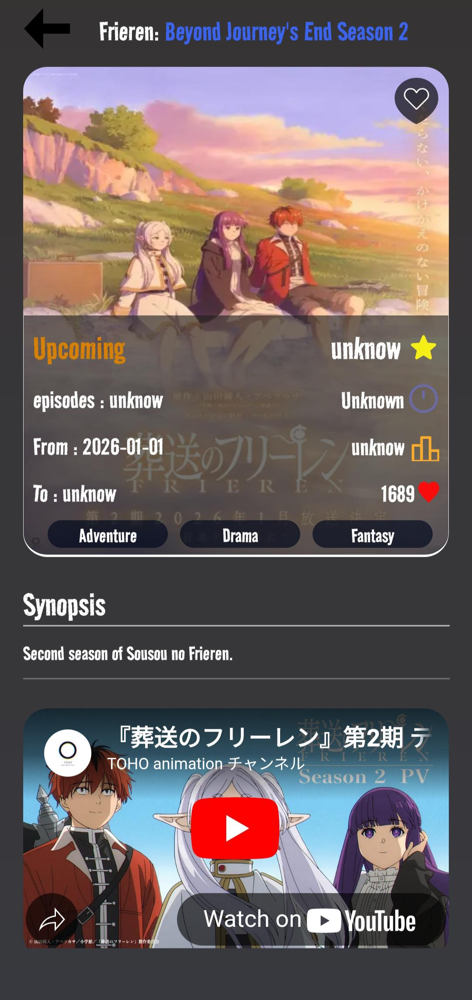

# 🌸 Anime World App

<p align="center">
  
  
  
</p>

> **Anime World** is your gateway to the anime universe!  
Browse, search, and explore your favorite anime series, characters, and trailers – all in a **smooth, modern, and responsive app**.  

---

## ✨ Features

- 🏠 **Home Page** – Discover trending and popular anime series.  
- 🔎 **Search by Name** – Find anime instantly with a powerful search bar.  
- 🎯 **Search by Type** – Browse by genres like *Action*, *Romance*, *Comedy*, *Isekai*, and more.  
- 📖 **Anime Details** – View synopsis, episodes, ratings, and recommendations.  
- ▶️ **Trailer Player** – Watch trailers using **YouTube Iframe** without leaving the app.  
- 💾 **Save Favorites** – Mark your favorite anime and access them anytime.  
- 🌓 **Beautiful UI** – Smooth animations, gradients, and a fully responsive layout.  

---

## 📸 Screenshots

| 🏠 Home | 🔎 Search | 🎯 Search by Type | 📖 Anime Info |
|--------|-----------|------------------|-------------|
|  |  |  |  |

---

## 🚀 Tech Stack

| Tool | Purpose |
|------|---------|
| ⚛️ **React Native 0.79** | Cross-platform mobile app |
| 🛠 **Expo 53** | Development & build tooling |
| 🧭 **Expo Router** | Navigation between screens |
| 🔐 **Expo Auth Session** + **Google Sign-In** | Secure login/authentication |
| 🗂 **Redux Toolkit** + **React Redux** | Global state management |
| 🔄 **React Query** | Data fetching, caching & synchronization |
| 🌐 **Axios** | API requests |
| 🖼 **React Native Paper** | Modern UI components |
| 🌀 **Moti** + **Reanimated 3** | Smooth animations |
| 🎠 **Reanimated Carousel** | Animated anime sliders |
| 🎥 **React Native YouTube Iframe** | Embedded trailers |
| 🌍 **React Native WebView** | In-app browser for extra content |
| 📏 **Responsive Dimensions & Fontsize** | Consistent design across all screens |
| ⚡ **FlashList** | High-performance list rendering |
| ✨ **Expo Blur & Linear Gradient** | Beautiful UI effects |

---

## 📦 Installation

1. **Clone the repository**
   ```bash
   git clone https://github.com/yourusername/anmie-world.git
